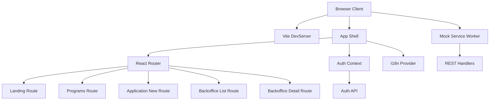
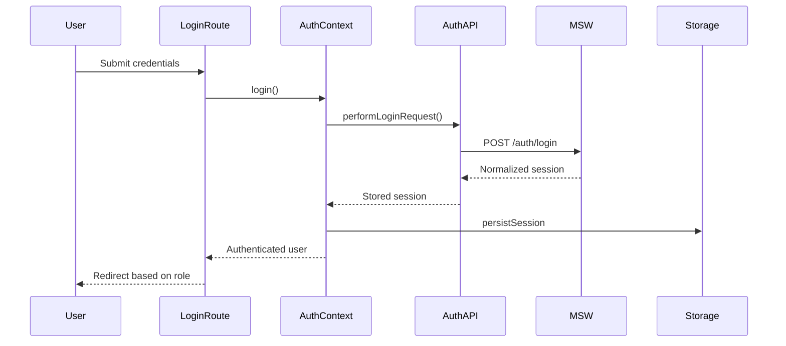
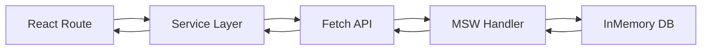
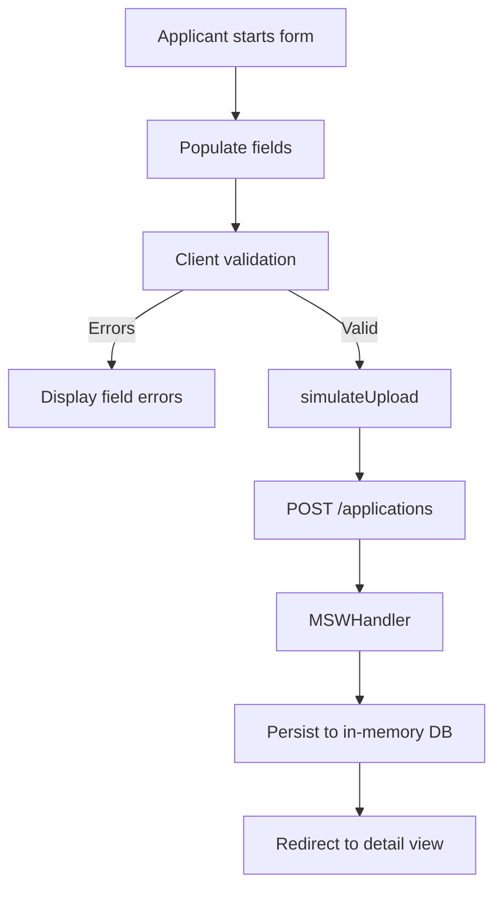

# Architecture Documentation Implementation Plan

## Purpose
- Provide a comprehensive architecture narrative targeted at onboarding frontend developers joining the KfW Mini-Förderportal project.
- Deliverables will be compiled into `docs/architecture.md` in Code mode, following the outline validated with the user.
- Documentation must embed Mermaid diagrams to visualise runtime topology, authentication flows, mock data pipeline, and user journeys, ensuring compatibility with the rendering constraints (no parentheses or double quotes inside Mermaid node brackets).

## Section-by-Section Authoring Notes

### 1. Executive summary and scope
- Frame the project as a deterministic training scaffold for Cypress automation.
- Highlight the dual personas (applicant vs officer) exposed via navigation shell in [`App.tsx`](client/src/app/App.tsx).
- Call out deterministic fixtures sourced from [`mocks/db.json`](mocks/db.json) and seeded through [`seed.mjs`](scripts/seed.mjs).

### 2. Technology stack and tooling overview
- Enumerate runtime prerequisites (Node 22+, npm 10+) from [`README.md`](client/README.md).
- Summarise dependencies from [`package.json`](client/package.json) including React 19.2, Vite 7, TypeScript 5.6.
- Document linting (ESLint flat config), formatting (Prettier), and note Cypress focus even if suites are not yet authored.

### 3. Runtime bootstrap and provider composition
- Describe bootstrap flow in [`main.tsx`](client/src/main.tsx):
  - `enableMocking` gate checks `import.meta.env.DEV` and `VITE_API_MOCKING`.
  - Worker bootstrap via [`startWorker`](client/src/mocks/browser.ts:8).
  - React root wrapping order: [`AuthProvider`](client/src/lib/auth.context.tsx:36) outside [`I18nProvider`](client/src/lib/i18n.tsx:35) surrounding [`App`](client/src/app/App.tsx).
- Mention `StrictMode` implications for double invocation in dev.

### 4. Application shell and routing topology
- Detail layout structure, language switcher, simulator controls, and authenticated header in [`App.tsx`](client/src/app/App.tsx).
- Enumerate routes exported from [`routes/index.ts`](client/src/routes/index.ts) and guard usage via [`RequireRole`](client/src/lib/auth.guards.tsx:58).
- Include the following Mermaid diagram:



### 5. Domain feature modules
- Applicant flow:
  - Form logic [`useApplicationForm`](client/src/routes/ApplicationNew/hooks/useApplicationForm.ts:22).
  - Program loader [`usePrograms`](client/src/routes/ApplicationNew/hooks/usePrograms.ts:8).
  - Service facades [`applicationService.ts`](client/src/routes/ApplicationNew/services/applicationService.ts:1) and [`programService.ts`](client/src/routes/ApplicationNew/services/programService.ts:1).
  - Primaries from UI components under [`components`](client/src/routes/ApplicationNew/components).
- Officer flow:
  - Backoffice listing with filters [`BackofficeList.tsx`](client/src/routes/BackofficeList.tsx).
  - Detailed view fetching relationships [`ApplicationDetail.tsx`](client/src/routes/ApplicationDetail.tsx).
- Reference deterministic types from [`types.ts`](client/src/routes/ApplicationNew/types.ts).

### 6. Authentication lifecycle and storage
- Explain state machine within [`AuthProvider`](client/src/lib/auth.context.tsx:36) covering hydration, login, logout, storage sync.
- Outline HTTP contract normalisation in [`auth.api.ts`](client/src/lib/auth.api.ts:22) and persistence helpers in [`auth.storage.ts`](client/src/lib/auth.storage.ts:6).
- Document guard mechanics [`RequireAuth`](client/src/lib/auth.guards.tsx:13) and [`RequireRole`](client/src/lib/auth.guards.tsx:58).
- Embed Mermaid sequence to illustrate login journey:



### 7. Internationalization strategy
- Document language map and runtime switching from [`i18n.tsx`](client/src/lib/i18n.tsx).
- Describe translation key conventions (nav labels via `t('landing')`, etc.) in [`App.tsx`](client/src/app/App.tsx:135).
- Note default language persistence expectations (currently in-memory, no storage).

### 8. Mock API and data layer
- Explain seed imports from [`seeds.ts`](client/src/mocks/db/seeds.ts) and linkage to [`shared/fixtures.js`](shared/fixtures.js).
- Describe handler aggregation in [`mocks/handlers/index.ts`](client/src/mocks/handlers/index.ts) and separation between [`browser.ts`](client/src/mocks/browser.ts) and [`server.ts`](client/src/mocks/server.ts) for dev vs tests.
- Highlight request utilities (URL resolution, JSON guards) in [`ApplicationNew/utils.ts`](client/src/routes/ApplicationNew/utils.ts).
- Include Mermaid data flow:



### 9. Styling system and UI conventions
- Summarise global tokens, layout primitives, and responsive breakpoints from [`global.css`](client/src/styles/global.css).
- Provide guidance for extending `.app-card`, `.application-*`, `.eligibility-*` classes.
- Note typography, color strategy, and use of CSS variables (if added later).

### 10. Primary user journeys
- Eligibility self-check on [`Landing.tsx`](client/src/routes/Landing.tsx) with emphasis on client-side validation.
- Applicant submission capturing validation, upload simulation, navigation redirect.
- Officer review path combining list and detail features.
- Mermaid flow for submission already provided; add activity diagram for eligibility and review:



```mermaid
flowchart LR
  OfficerStart[Officer opens dashboard] --> LoadList[listApplications()]
  LoadList --> Filter[Apply status filter]
  Filter --> SelectRow[Open application detail]
  SelectRow --> FetchDetail[getApplication()]
  FetchDetail --> ReviewData[Review applicant data and comments]
```

### 11. Testing and quality gates
- Document linting (`npm run lint`), formatting (`npm run format`), typechecking (`npm run typecheck`), build (`npm run build`).
- Emphasise Cypress scope, deterministic dataset seeded via [`seed.mjs`](scripts/seed.mjs).
- Include future `npm run start:all` placeholder context.

### 12. Environment configuration and build pipeline
- Describe `.env` contract referencing [`client/.env.example`](client/.env.example) and runtime exposure via Vite.
- Explain Vite dev and preview server defaults in [`vite.config.ts`](client/vite.config.ts).
- Note integration path for future Express/json-server wrapper on port 3001.

### 13. Onboarding checklist, resources, glossary
- Provide step-by-step onboarding tasks (clone, install, copy env, run dev, seed fixtures, test login roles).
- Link to key entry files (App shell, Auth provider, mocks) using clickable references.
- Add glossary for domain terms (applicant, officer, application status from [`status.ts`](client/src/lib/status.ts)).

## Additional Authoring Guidance
- Use consistent heading hierarchy (## for top-level sections, ### for subtopics).
- Reference source files with required clickable syntax.
- Ensure Mermaid diagrams avoid parentheses or double quotes inside node brackets to comply with rendering guidance.
- Include callouts or admonitions only if supported by the Markdown renderer in downstream tooling; otherwise prefer bolded notes.
- Close the document with a “Next steps” section for developers (e.g., implement API wrapper, expand Cypress suites).

## Handoff Checklist Prior to Switching Modes
- Validate that the approved outline and this plan remain aligned; update if source changes occur before implementation.
- Confirm with the user after presenting this plan whether to proceed to Code mode for drafting `docs/architecture.md`.