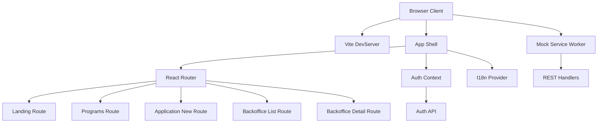
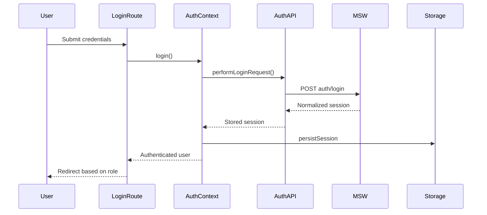
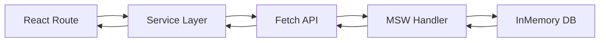
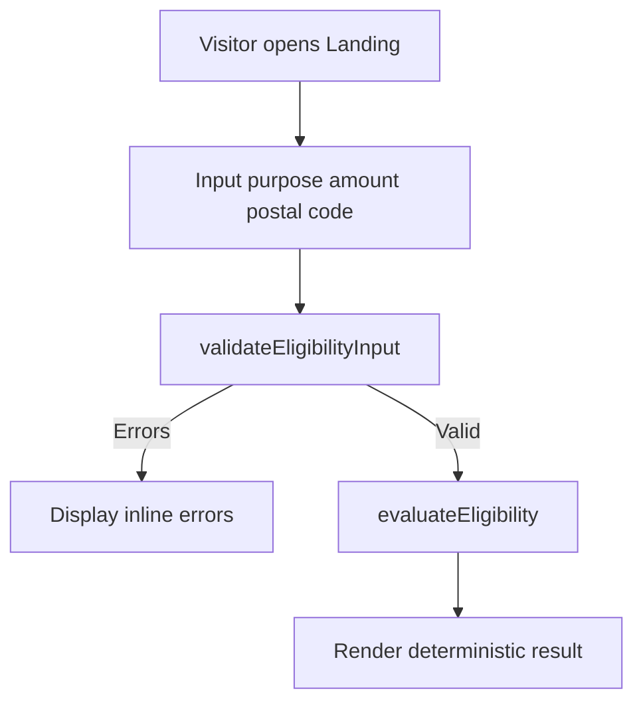
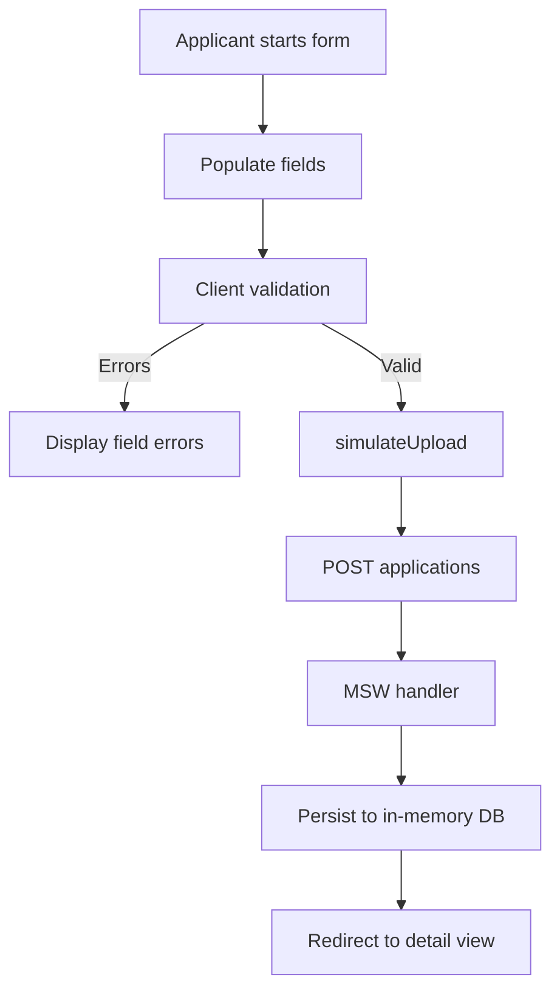

# KfW Mini-Förderportal Frontend Architecture

## 1. Executive summary and scope

- The KfW Mini-Förderportal front end is a deterministic training scaffold built to coach Cypress E2E testing while mirroring key workflows of a funding portal. The application shell in [`App.tsx`](client/src/app/App.tsx) exposes dual personas (applicant vs officer) and deterministic simulator controls so tests remain stable over time.
- Feature routes such as [`Landing`](client/src/routes/Landing.tsx), [`ApplicationNew`](client/src/routes/ApplicationNew.tsx), [`BackofficeList`](client/src/routes/BackofficeList.tsx), and [`BackofficeDetail`](client/src/routes/BackofficeDetail.tsx) compose realistic yet mock-backed experiences, supported by domain hooks like [`useApplicationForm`](client/src/routes/ApplicationNew/hooks/useApplicationForm.ts:22).
- Fixtures seeded via [`scripts/seed.mjs`](scripts/seed.mjs) and imported into the mock database through [`client/src/mocks/db/seeds.ts`](client/src/mocks/db/seeds.ts) guarantee deterministic data snapshots across development, testing, and workshops.

This document explains the runtime architecture, module boundaries, data flows, and onboarding guidance tailored for frontend developers joining the project.

## 2. Technology stack and tooling overview

| Concern | Tooling | References | Notes |
| --- | --- | --- | --- |
| Runtime prerequisites | Node.js ≥ 22, npm ≥ 10 | [`client/README.md`](client/README.md) | Aligns with MSW ESM pipeline and Vite 7 requirements. |
| Frameworks | React 19.2, React Router 7, TypeScript 5.6 | [`client/package.json`](client/package.json) | React 19 concurrent-ready APIs with strict mode. |
| Bundler & dev server | Vite 7 | [`client/package.json`](client/package.json) [`client/vite.config.ts`](client/vite.config.ts) | Fast HMR, alias `@`→`src`. |
| Linting & formatting | ESLint (flat config), `@typescript-eslint`, Prettier | [`client/eslint.config.js`](client/eslint.config.js) [`client/.prettierrc.json`](client/.prettierrc.json) | Ensure consistent style and accessibility linting. |
| Testing focus | Cypress (future suites), MSW for mocks | [`client/cypress`](client/cypress) [`client/src/mocks/browser.ts`](client/src/mocks/browser.ts) | Repo scaffold prepared for deterministic E2E flows. |

## 3. Runtime bootstrap and provider composition

1. [`bootstrap`](client/src/main.tsx:23) awaits [`enableMocking`](client/src/main.tsx:10). When `import.meta.env.DEV` and `VITE_API_MOCKING` ≠ `off`, MSW spins up via [`startWorker`](client/src/mocks/browser.ts:8).
2. The React root is created with `StrictMode`, then composed as [`AuthProvider`](client/src/lib/auth.context.tsx:36) → [`I18nProvider`](client/src/lib/i18n.tsx:35) → [`App`](client/src/app/App.tsx), ensuring authentication and translation contexts precede the shell.
3. Strict mode double-renders in development by design, surfacing side-effect safety issues early (e.g., idempotent seeding in mocks).

## 4. Application shell and routing topology

- The shell in [`App.tsx`](client/src/app/App.tsx) renders header metadata, language toggle, latency/error simulator controls, main navigation, and authentication status panel. Hooks from [`useAuth`](client/src/lib/auth.context.tsx:221) and [`useI18n`](client/src/lib/i18n.tsx:45) drive UI state.
- Navigation routes are exported via [`routes/index.ts`](client/src/routes/index.ts) and wrapped with [`BrowserRouter`](client/src/app/App.tsx:59). Role-gated links rely on [`RequireRole`](client/src/lib/auth.guards.tsx:58).
- Advanced simulator inputs synchronise query params for Cypress reproducibility by leveraging the `URLSearchParams` side effect inside [`App`](client/src/app/App.tsx:44).

| Path | Component | Access control | Key notes |
| --- | --- | --- | --- |
| `/` | [`Landing`](client/src/routes/Landing.tsx) | Public | Eligibility pre-check with deterministic scoring. |
| `/programs` | [`Programs`](client/src/routes/Programs.tsx) | Public | Placeholder for catalogue expansion. |
| `/login` | [`Login`](client/src/routes/Login.tsx) | Public (hidden when authenticated) | Quick-fill buttons for applicant/officer credentials. |
| `/applications/new` | [`ApplicationNew`](client/src/routes/ApplicationNew.tsx) | [`RequireRole`](client/src/lib/auth.guards.tsx:58) (applicant) | Multi-field form with file upload simulation. |
| `/applications/:applicationId` | [`ApplicationDetail`](client/src/routes/ApplicationDetail.tsx) | Applicant | Protected detail view seeded via mocks. |
| `/backoffice/applications` | [`BackofficeList`](client/src/routes/BackofficeList.tsx) | Officer | List + status filter fed by mock service. |
| `/backoffice/applications/:applicationId` | [`BackofficeDetail`](client/src/routes/BackofficeDetail.tsx) | Officer | Officer-facing detail review screen. |
| `*` | [`NotFound`](client/src/routes/NotFound.tsx) | Public | Deterministic fallback for Cypress assertions. |

## 5. Domain feature modules

### 5.1 Applicant experience

- [`ApplicationNew`](client/src/routes/ApplicationNew.tsx) wraps the applicant form UI and delegates state orchestration to [`useApplicationForm`](client/src/routes/ApplicationNew/hooks/useApplicationForm.ts:22), which validates fields, manages submission stages (`upload`, `submit`), and redirects post-success.
- File upload simulation delegates to [`simulateUpload`](client/src/routes/ApplicationNew/services/applicationService.ts:8), enabling Cypress to assert against multi-stage progress without real file I/O, while [`createApplication`](client/src/routes/ApplicationNew/services/applicationService.ts:34) persists deterministic records.
- Program options hydrate through [`usePrograms`](client/src/routes/ApplicationNew/hooks/usePrograms.ts:8), which in turn depends on [`fetchPrograms`](client/src/routes/ApplicationNew/services/programService.ts:9) and [`normalizePrograms`](client/src/routes/ApplicationNew/utils.ts:10) for deterministic dropdown content.
- Presentational components (`AmountInput`, `ProgramSelect`, etc.) live under [`client/src/routes/ApplicationNew/components`](client/src/routes/ApplicationNew/components) to keep the form atomic and testable.

### 5.2 Officer workspace

- [`BackofficeList`](client/src/routes/BackofficeList.tsx) loads applications via [`listApplications`](client/src/routes/ApplicationNew/services/applicationService.ts:57), exposes status filtering, and links into officer-only detail pages.
- [`ApplicationDetail`](client/src/routes/ApplicationDetail.tsx) composes detail fields with program metadata fetched through [`fetchPrograms`](client/src/routes/ApplicationNew/services/programService.ts:9), using [`safeJson`](client/src/routes/ApplicationNew/utils.ts:35) and [`extractErrorMessage`](client/src/routes/ApplicationNew/utils.ts:43) for resilient fetch handling.

### 5.3 Shared foundations

- Data contracts and payload helpers are defined in [`types.ts`](client/src/routes/ApplicationNew/types.ts), keeping applicant/officer modules aligned with MSW fixtures.
- Cross-cutting utilities in [`ApplicationNew/utils.ts`](client/src/routes/ApplicationNew/utils.ts) provide API URL resolution, safe JSON parsing, and normalisation logic reused by services and components.

## 6. Authentication lifecycle and storage

- [`AuthProvider`](client/src/lib/auth.context.tsx:36) manages an [`AuthSessionSnapshot`](client/src/lib/auth.types.ts:22) state machine: `loading` → `authenticated`/`unauthenticated` with persisted tokens stored via [`persistSession`](client/src/lib/auth.storage.ts:28).
- Initial hydration reads local storage (`readStoredSession`) and validates tokens through [`fetchSessionSnapshot`](client/src/lib/auth.api.ts:22). Storage events keep multiple tabs in sync.
- Login flows invoke [`performLoginRequest`](client/src/lib/auth.api.ts:46) and on success call [`persistSession`](client/src/lib/auth.storage.ts:28); logout dispatches [`clearStoredSession`](client/src/lib/auth.storage.ts:36) and resets context state.
- Guards [`RequireAuth`](client/src/lib/auth.guards.tsx:13) and [`RequireRole`](client/src/lib/auth.guards.tsx:58) wrap route elements to enforce persona visibility.

## 7. Internationalization strategy

- [`I18nProvider`](client/src/lib/i18n.tsx:35) holds current language (`'de'` default) and exposes `t()` lookups sourced from the local `translations` map.
- Navigation labels and select options inside [`App`](client/src/app/App.tsx:74) retrieve translated strings on render, ensuring toggles respond instantly.
- To add new keys, update `translations` in [`i18n.tsx`](client/src/lib/i18n.tsx:6) and consume via `t('key')`. Persistence to storage can be added later by enhancing `I18nProvider`.

## 8. Mock API and data layer

- Deterministic fixtures imported from [`shared/fixtures.js`](shared/fixtures.js) populate seed constants in [`client/src/mocks/db/seeds.ts`](client/src/mocks/db/seeds.ts). The same dataset powers MSW handlers and external `json-server` consumers via [`scripts/seed.mjs`](scripts/seed.mjs).
- Handlers aggregated in [`client/src/mocks/handlers/index.ts`](client/src/mocks/handlers/index.ts) respond to `/auth`, `/programs`, and `/applications` routes. Browser-specific wiring uses [`worker.start`](client/src/mocks/browser.ts:8), while Node test scenarios use [`server.listen`](client/src/mocks/server.ts:8).
- Fetch helpers guarantee stability: [`resolveApiUrl`](client/src/routes/ApplicationNew/utils.ts:58) respects `VITE_API_URL`, [`safeJson`](client/src/routes/ApplicationNew/utils.ts:35) shields against empty bodies, and [`extractErrorMessage`](client/src/routes/ApplicationNew/utils.ts:43) surfaces friendly errors.

## 9. Styling system and UI conventions

- Global tokens and layout primitives live in [`global.css`](client/src/styles/global.css), defining typography (`Inter` stack), color palette, and spacing rhythm applied across `.app-shell`, `.app-card`, and form classes.
- Components follow utility-like naming (`.application-input`, `.eligibility-result`) to simplify Cypress selectors and maintain design consistency.
- Responsive breakpoints at 1024px and 768px adjust grid layouts without introducing JS-driven layout logic.

## 10. Primary user journeys

### 10.1 Eligibility self-check

- [`Landing`](client/src/routes/Landing.tsx) collects purpose, amount, and postal code, validating inputs through [`validateEligibilityInput`](client/src/lib/eligibility.ts:65) and computing outcomes via [`evaluateEligibility`](client/src/lib/eligibility.ts:107).
- Inline errors leverage semantic `aria` attributes, and deterministic outcomes render via `result.checks` for predictable assertions.

### 10.2 Applicant submission

- [`ApplicationNew`](client/src/routes/ApplicationNew.tsx) combines presentational components with [`useApplicationForm`](client/src/routes/ApplicationNew/hooks/useApplicationForm.ts:22) to orchestrate validation, upload simulation, and submission before redirecting to detail view.
- Services [`simulateUpload`](client/src/routes/ApplicationNew/services/applicationService.ts:8) and [`createApplication`](client/src/routes/ApplicationNew/services/applicationService.ts:34) return deterministic responses seeded by MSW.

### 10.3 Officer review

- Officers hit [`BackofficeList`](client/src/routes/BackofficeList.tsx) to inspect submissions by status, then drill into [`ApplicationDetail`](client/src/routes/ApplicationDetail.tsx) for applicant metadata and comments.
- Actions reuse the same service layer (`listApplications`, `getApplication`) to keep applicant/officer parity.

## 11. Testing and quality gates

- Run `npm run lint`, `npm run typecheck`, and `npm run build` (see [`client/package.json`](client/package.json)) before submitting changes to guarantee formatting, type safety, and build health.
- Cypress suites reside in [`client/cypress/e2e`](client/cypress/e2e); extend them using deterministic selectors (`data-testid`) exposed throughout the UI.
- Regenerate fixture snapshots as needed with `npm run seed`, which persists to [`mocks/db.json`](mocks/db.json) for downstream API consumers.

## 12. Environment configuration and build pipeline

- Copy [`client/.env.example`](client/.env.example) to `.env.development` to configure `VITE_API_URL`, `VITE_API_MOCKING`, and optional `VITE_API_DELAY_MS`.
- Vite dev server defaults to port 5173 as set in [`vite.config.ts`](client/vite.config.ts); preview builds run on 4173 for post-build verification.
- When the Express wrapper materialises, point `VITE_API_MOCKING` to `off` so calls reach the backend at `http://localhost:3001`.

## 13. Onboarding checklist, resources, and glossary

### 13.1 Onboarding checklist

1. Clone the repository and open the workspace at `/home/pai/Work/cypress-lab`.
2. `cd client` and run `npm install`.
3. Copy environment defaults: `cp .env.example .env.development`.
4. (Optional) Seed external fixtures: `npm run seed` to refresh [`mocks/db.json`](mocks/db.json).
5. Start the dev server with `npm run dev` and verify the shell at `http://localhost:5173`.
6. Use the quick-fill buttons in [`Login`](client/src/routes/Login.tsx) to sign in as applicant (`alice/test123`) and officer (`officer/test123`).
7. Explore applicant and officer routes, noting deterministic data for Cypress baseline tests.

### 13.2 Key resources

- Shell and routing: [`App.tsx`](client/src/app/App.tsx), [`routes/index.ts`](client/src/routes/index.ts).
- Authentication: [`auth.context.tsx`](client/src/lib/auth.context.tsx), [`auth.api.ts`](client/src/lib/auth.api.ts), [`auth.storage.ts`](client/src/lib/auth.storage.ts).
- Applicant module: [`ApplicationNew.tsx`](client/src/routes/ApplicationNew.tsx), [`useApplicationForm`](client/src/routes/ApplicationNew/hooks/useApplicationForm.ts:22), [`applicationService.ts`](client/src/routes/ApplicationNew/services/applicationService.ts:1).
- Officer module: [`BackofficeList.tsx`](client/src/routes/BackofficeList.tsx), [`ApplicationDetail.tsx`](client/src/routes/ApplicationDetail.tsx).
- Mock infrastructure: [`mocks/browser.ts`](client/src/mocks/browser.ts), [`mocks/server.ts`](client/src/mocks/server.ts), [`mocks/handlers/index.ts`](client/src/mocks/handlers/index.ts).
- Styling foundation: [`global.css`](client/src/styles/global.css).

### 13.3 Glossary

| Term | Definition | Source |
| --- | --- | --- |
| Applicant (Antragsteller\*in) | Persona who submits funding applications and accesses `/applications/*`. | [`ApplicationNew.tsx`](client/src/routes/ApplicationNew.tsx) |
| Officer (Sachbearbeiter\*in) | Persona reviewing submissions within the backoffice workspace. | [`BackofficeList.tsx`](client/src/routes/BackofficeList.tsx) |
| Application status | Enum describing submission lifecycle (`submitted`, `review`, `approved`, `rejected`). | [`statusLabelDe`](client/src/lib/status.ts:3) |
| MSW (Mock Service Worker) | Service worker intercepting API calls in dev/test environments. | [`startWorker`](client/src/mocks/browser.ts:8) |
| Service layer | Fetch helpers mediating between components and API endpoints. | [`applicationService.ts`](client/src/routes/ApplicationNew/services/applicationService.ts:1) |

## 14. Next steps

- Integrate the Express/json-server wrapper under `npm run api`, aligning response contracts with [`auth.api.ts`](client/src/lib/auth.api.ts) and service expectations.
- Expand Cypress coverage to include officer approval workflows and simulator toggles using the deterministic hooks documented above.
- Enhance i18n by persisting language selection (e.g., via local storage) within [`I18nProvider`](client/src/lib/i18n.tsx:35) and expanding translation keys for additional routes.